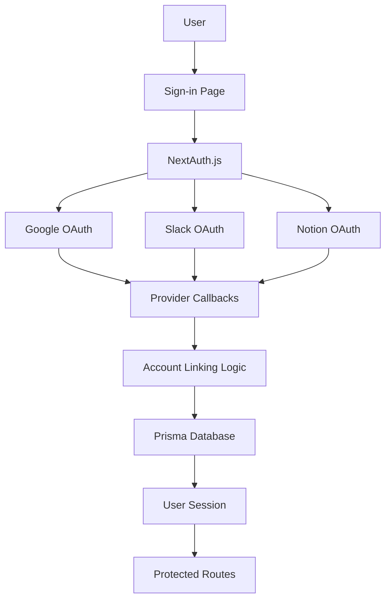

# Design Document

## Overview

This design implements a multi-provider authentication system that replaces the current Discord-only setup with support for Google, Slack, and Notion OAuth providers. The system leverages NextAuth.js with provider-specific configurations, maintains backward compatibility with the existing database schema, and provides a unified authentication experience.

## Architecture

### High-Level Architecture



### Authentication Flow

1. **Initial Authentication**: User selects provider → OAuth redirect → Provider authorization → Callback handling → Account creation/linking
2. **Account Linking**: Authenticated user → Additional provider selection → OAuth flow → Link to existing account
3. **Token Management**: Automatic refresh → Failure handling → Re-authentication prompts

## Components and Interfaces

### 1. Provider Configuration

**File**: `src/server/auth/providers/index.ts`
- Centralized provider configurations
- Environment variable validation
- Provider-specific scopes and options

**File**: `src/server/auth/providers/google.ts`
```typescript
export const googleProvider = GoogleProvider({
  clientId: env.AUTH_GOOGLE_ID,
  clientSecret: env.AUTH_GOOGLE_SECRET,
  authorization: {
    params: {
      scope: "openid email profile",
      access_type: "offline",
      prompt: "consent"
    }
  }
})
```

**File**: `src/server/auth/providers/slack.ts`
```typescript
export const slackProvider = SlackProvider({
  clientId: env.AUTH_SLACK_ID,
  clientSecret: env.AUTH_SLACK_SECRET,
  authorization: {
    params: {
      scope: "identity.basic identity.email identity.avatar"
    }
  }
})
```

**File**: `src/server/auth/providers/notion.ts`
```typescript
export const notionProvider = {
  id: "notion",
  name: "Notion",
  type: "oauth",
  authorization: "https://api.notion.com/v1/oauth/authorize",
  token: "https://api.notion.com/v1/oauth/token",
  userinfo: "https://api.notion.com/v1/users/me",
  // Custom Notion OAuth implementation
}
```

### 2. Enhanced Authentication Configuration

**File**: `src/server/auth/config.ts`
- Updated provider array with conditional loading
- Enhanced callbacks for account linking
- Custom session handling for multiple providers

### 3. Account Management Service

**File**: `src/server/services/account-manager.ts`
```typescript
interface AccountManager {
  linkAccount(userId: string, provider: string, account: Account): Promise<void>
  unlinkAccount(userId: string, provider: string): Promise<void>
  getLinkedAccounts(userId: string): Promise<Account[]>
  refreshTokens(accountId: string): Promise<boolean>
}
```

### 4. Token Management System

**File**: `src/server/services/token-manager.ts`
```typescript
interface TokenManager {
  refreshAccessToken(account: Account): Promise<Account | null>
  isTokenExpired(account: Account): boolean
  revokeTokens(account: Account): Promise<void>
}
```

### 5. User Interface Components

**File**: `src/components/auth/provider-buttons.tsx`
- Individual provider sign-in buttons
- Consistent styling and branding
- Loading states and error handling

**File**: `src/components/auth/account-linking.tsx`
- Interface for linking additional accounts
- Display of currently linked providers
- Unlinking functionality

## Data Models

### Enhanced Account Model

The existing Prisma Account model already supports the required fields for multiple OAuth providers:

```prisma
model Account {
  id                       String  @id @default(cuid())
  userId                   String
  type                     String
  provider                 String  // "google", "slack", "notion"
  providerAccountId        String
  refresh_token            String? 
  access_token             String? 
  expires_at               Int?
  token_type               String?
  scope                    String?
  id_token                 String? 
  session_state            String?
  user                     User    @relation(fields: [userId], references: [id], onDelete: Cascade)
  refresh_token_expires_in Int?

  @@unique([provider, providerAccountId])
}
```

### User Profile Normalization

```typescript
interface NormalizedUser {
  id: string
  name: string | null
  email: string | null
  image: string | null
  providers: {
    google?: GoogleProfile
    slack?: SlackProfile  
    notion?: NotionProfile
  }
}
```

## Error Handling

### 1. OAuth Flow Errors
- Invalid credentials → Clear error messages
- User cancellation → Graceful redirect to sign-in
- Provider downtime → Fallback options

### 2. Token Management Errors
- Refresh failure → Mark for re-authentication
- Revocation errors → Log and continue
- Network timeouts → Retry logic

### 3. Account Linking Errors
- Duplicate linking attempts → Prevention with clear messaging
- Email conflicts → Smart resolution prompts
- Permission errors → Clear explanation of requirements

## Testing Strategy

### 1. Unit Tests
- Provider configuration validation
- Token refresh logic
- Account linking/unlinking operations
- User profile normalization

### 2. Integration Tests
- Complete OAuth flows for each provider
- Account linking scenarios
- Token refresh workflows
- Error handling paths

### 3. End-to-End Tests
- Sign-in with each provider
- Multi-provider account management
- Session persistence across providers
- Sign-out and cleanup

### 4. Security Tests
- Token encryption verification
- CSRF protection validation
- Session hijacking prevention
- OAuth state parameter validation

## Security Considerations

### 1. Token Storage
- Encrypt sensitive tokens in database
- Use secure HTTP-only cookies for sessions
- Implement proper token rotation

### 2. OAuth Security
- PKCE implementation for additional security
- State parameter validation
- Nonce verification for OpenID Connect

### 3. Account Protection
- Rate limiting on authentication attempts
- Suspicious activity detection
- Secure account linking validation

## Environment Configuration

Required environment variables:
```bash
# Google OAuth
AUTH_GOOGLE_ID=your_google_client_id
AUTH_GOOGLE_SECRET=your_google_client_secret

# Slack OAuth  
AUTH_SLACK_ID=your_slack_client_id
AUTH_SLACK_SECRET=your_slack_client_secret

# Notion OAuth
AUTH_NOTION_ID=your_notion_client_id
AUTH_NOTION_SECRET=your_notion_client_secret

# NextAuth
NEXTAUTH_SECRET=your_nextauth_secret
NEXTAUTH_URL=http://localhost:3000
```

## Migration Strategy

### 1. Database Migration
- No schema changes required (existing Account model supports multiple providers)
- Remove Discord-specific data if needed

### 2. Code Migration
- Replace Discord provider configuration
- Update environment variables
- Modify sign-in UI components

### 3. User Migration
- Existing users can link new providers
- Discord accounts (if any) can be migrated or removed